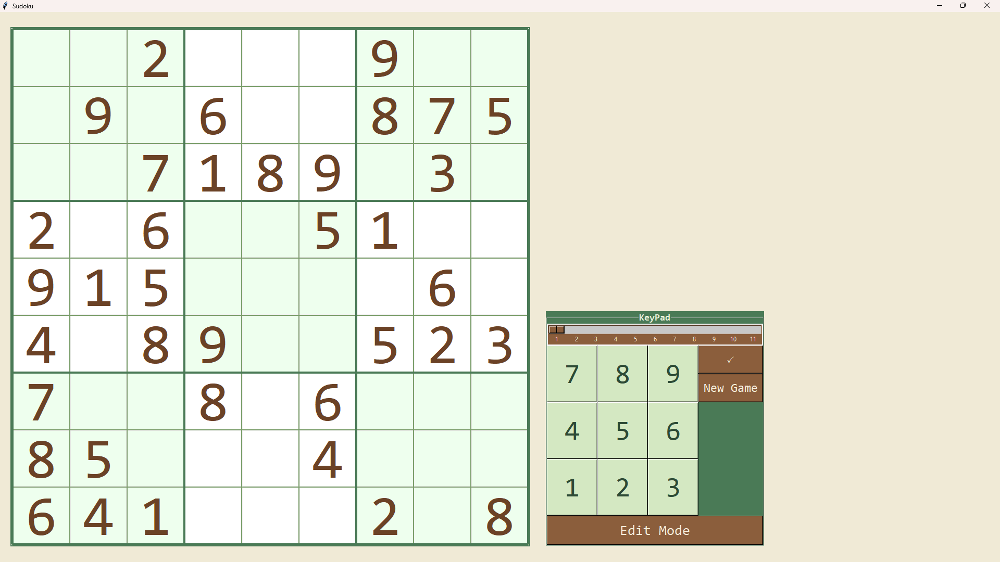

# Sudoku

A Python desktop Sudoku game built with Tkinter, featuring procedural puzzle generation, a backtracking solver with MRV heuristics, and a polished earthy-green GUI.

---

## Features

- **Procedural puzzle generation** — every game is unique, seeded from a fully solved board
- **11 difficulty levels** — from beginner (≈38 clues) to expert minimal (17 clues)
- **Unique-solution guarantee** — a solution counter prunes any puzzle that becomes ambiguous during generation
- **MRV solver** — Minimum Remaining Values heuristic makes the backtracking solver fast enough to power real-time generation
- **Live validation** — invalid entries are flagged in red immediately; correct entries render in brown
- **Keyboard navigation** — move between cells with arrow keys; enter digits directly from the numpad or keyboard
- **Keypad widget** — on-screen digit buttons for mouse-only play
- **Edit Mode** — unlock all cells to set up a custom starting position
- **Check Solution** — verify the current board state against the unique solution
- **New Game** — generate a fresh puzzle at any chosen difficulty without restarting the app

---

## Screenshot



---

## Getting Started

### Option 1 — Download the executable (Windows)

No Python installation needed.

1. Go to the [**Releases**](https://github.com/Ashish1455/Sudoku/releases) page
2. Download **`SudokuApp.exe`** from the latest release
3. Double-click to run — no installation required

> **Note:** The zip and tar.gz archives on the releases page are auto-generated source snapshots by GitHub, not the game. Download `SudokuApp.exe` only.

---

### Option 2 — Run from source (Windows / macOS / Linux)

**Requirements**

- Python 3.8+
- Tkinter

```bash
# Ubuntu / Debian
sudo apt install python3-tk
```

No third-party packages are required.

```bash
git clone https://github.com/Ashish1455/Sudoku.git
cd Sudoku
python main.py
```

---

## Controls

| Action | Input |
|---|---|
| Select a cell | Click |
| Move between cells | Arrow keys |
| Enter a digit | Number keys `1`–`9` or on-screen keypad |
| Clear a cell | Re-enter the same digit |
| Check solution | `🗸` button |
| New game | Adjust difficulty slider → **New Game** |
| Edit / lock clues | **Edit Mode** button |

---

## Project Structure

```
Sudoku/
├── main.py               # Entry point — generates a puzzle and launches the window
├── view_window.py        # Tkinter GUI: board rendering, keypad, interactions
├── sudoku_generator.py   # Puzzle generation: solve → remove cells → ensure uniqueness
├── Sudoku_solver.py      # Backtracking solver with MRV heuristic + precomputed peers
├── rules.py              # Row / column / 3×3-box validation helpers
├── color_theme.py        # Centralised color palette constants
└── screenshot.png        # App screenshot
```

---

## How It Works

### Generation pipeline (`sudoku_generator.py`)

1. **Full solution** — `solveSudoku` fills a nearly-empty board in random order (shuffle mode), producing a valid, random completed grid.
2. **Diagonal pre-removal** — cells are quickly removed from the three main-diagonal 3×3 boxes first, which is always safe and speeds up the next step.
3. **Greedy removal with uniqueness check** — remaining filled cells are shuffled and removed one at a time. Before each removal is committed, `solution_counter` verifies the puzzle still has exactly one solution; if not, the cell is restored.
4. **Difficulty target** — the number of clues left on the board is controlled by:
   - Levels 1–10: `40 - 2×difficulty` clues (±1 random variance), giving roughly 38 → 20 clues.
   - Level 11: exactly 17 clues (the theoretical minimum for a unique Sudoku).

### Solver (`Sudoku_solver.py`)

- **`precompute_cells()`** builds a peer-set for every cell (its row, column, and box) once at startup — avoiding repeated set construction during solving.
- **`mrv()`** selects the unfilled cell with the fewest legal digits at each step, dramatically reducing the search tree.
- **`backtrack()`** runs standard recursive backtracking, with optional shuffling (mode=1) for randomised generation.

---

## Colour Theme

All colours are defined in `color_theme.py` so the visual style can be changed in one place. The default palette uses warm parchment backgrounds with forest-green accents.

---

## License

MIT — see [LICENSE](LICENSE) for details.
